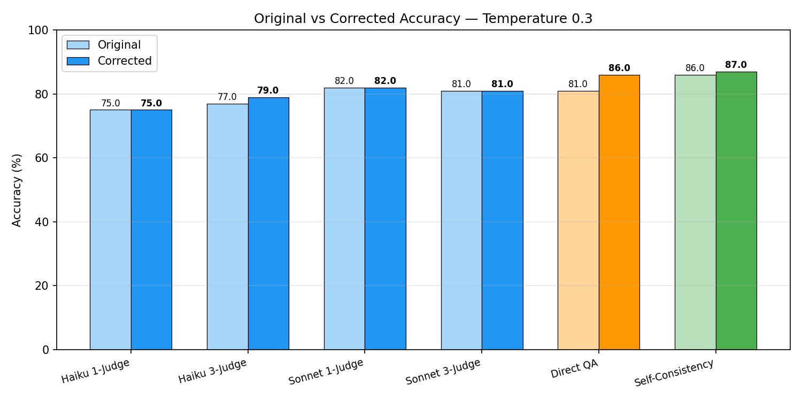
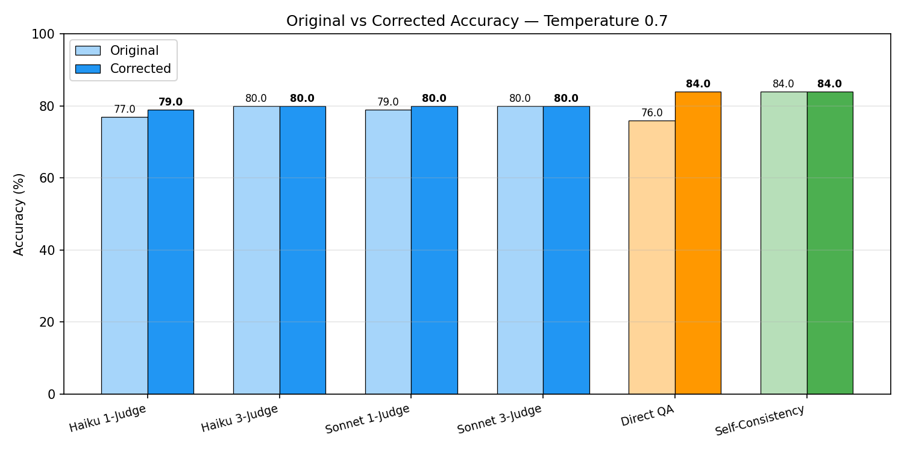
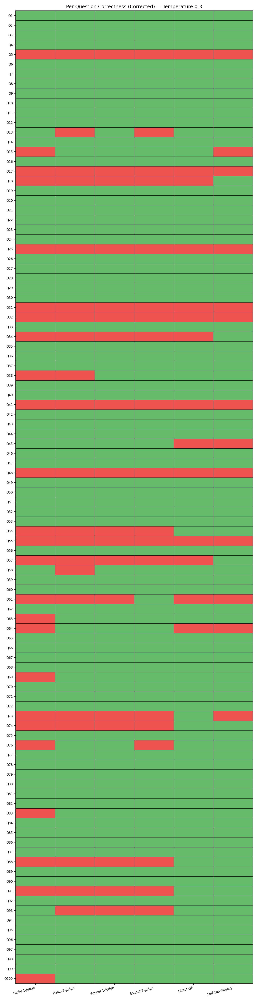
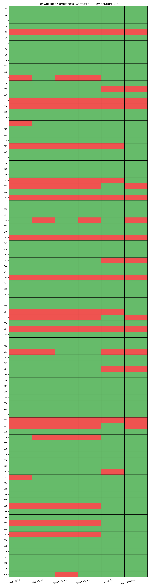

## 1. Methodology

### System Architecture

The system is a multi-agent debate pipeline with three roles: two debaters (A and B) and a judge. The codebase is organized into separate modules for debater logic, judge logic, API calls, data loading, and evaluation, with hyperparameters in a JSON config file and prompts stored as text templates in a `prompts/` directory.

The dataset is StrategyQA (Geva et al., 2021), a commonsense reasoning benchmark of yes/no questions requiring implicit reasoning strategies. 100 questions were drawn from a local cache of the dataset, originally fetched from HuggingFace.

### Debate Protocol

The pipeline follows a 4-phase protocol inspired by Irving, Christiano & Amodei (2018) and Liang et al. (EMNLP 2024):

**Phase 1 — Initialization:** The question is presented to both debaters independently. Each generates an initial position (answer + reasoning) without seeing the other's response. If both debaters agree at this stage, the debate is skipped and the consensus answer is forwarded directly to the judge.

**Phase 2 — Multi-Round Debate:** If the debaters disagree, they engage in up to 3 rounds of structured argument. Each round, Debater A argues first, then Debater B responds with access to A's argument. Both debaters see the full conversation history from all prior rounds. An adaptive stopping criterion ends the debate early if both debaters converge to the same answer for 2 consecutive rounds.

**Phase 3 — Judgment:** The judge receives the original question along with a formatted transcript of the full debate (initial positions + all rounds). It produces a chain-of-thought analysis, identifies the strongest and weakest arguments from each side, renders a final verdict (Yes/No), and assigns a confidence score from 1 to 5. In the multi-judge configuration, 3 independent judges evaluate the same transcript and the final answer is determined by majority vote.

**Phase 4 — Evaluation:** The judge's verdict is compared against the ground-truth answer. All intermediate data (initial positions, per-round arguments, judge reasoning, and verdict) is logged as JSON.

### Model Choices

All debaters use Claude Haiku 4.5, chosen for cost efficiency since the debate pipeline makes many API calls per question. The judge model was varied between Claude Haiku 4.5 and Claude Sonnet 4.6, and both single-judge and multi-judge (3 judges, majority vote) configurations were tested.

### Baselines

Two baselines were run for comparison, both using Claude Haiku 4.5 to match the debater model:

**Direct QA:** The model answers each question directly with chain-of-thought prompting in a single call, no debate, no multi-turn interaction.

**Self-Consistency (Wang et al., 2023):** The model generates 5 independent answers per question and the final answer is determined by majority vote. This baseline helps distinguish whether any accuracy gain from debate comes from the back-and-forth itself or simply from sampling multiple responses.

### Hyperparameters

| Parameter | Debate | Direct QA | Self-Consistency |
|-----------|--------|-----------|------------------|
| Model (debaters) | claude-haiku-4-5 | claude-haiku-4-5 | claude-haiku-4-5 |
| Model (judge) | varied | — | — |
| Temperature (debaters) | 0.3, 0.7 | 0.3, 0.7 | 0.3, 0.7 |
| Temperature (judge) | 0.3, 0.7 | — | — |
| Max tokens | 500 | 500 | 500 |
| Judge max tokens | 1000 | — | — |
| Num rounds | 3 | — | — |
| Sample count | — | — | 5 |
| Questions | 100 | 100 | 100 |

## 2. Experiments

### Experimental Setup

All experiments used the same 100 StrategyQA questions, specifically the first 100 from the test split. Each configuration was run once per temperature setting (0.3 and 0.7), giving a total of 12 runs. API cost influenced several design choices, including sample size, number of configurations, and model selection.

**Debate pipeline (8 runs):** Three variables were manipulated across runs: judge model (Haiku 4.5 vs Sonnet 4.6), number of judges (1 vs 3), and temperature (0.3 vs 0.7). Everything else was held constant.

| Run | Judge Model | Num Judges | Temperature |
|-----|-------------|------------|-------------|
| 1 | Haiku 4.5 | 1 | 0.3 |
| 2 | Haiku 4.5 | 1 | 0.7 |
| 3 | Haiku 4.5 | 3 | 0.3 |
| 4 | Haiku 4.5 | 3 | 0.7 |
| 5 | Sonnet 4.6 | 1 | 0.3 |
| 6 | Sonnet 4.6 | 1 | 0.7 |
| 7 | Sonnet 4.6 | 3 | 0.3 |
| 8 | Sonnet 4.6 | 3 | 0.7 |

**Baselines (4 runs):** Direct QA and self-consistency were each run at both temperature settings.

| Run | Method | Temperature |
|-----|--------|-------------|
| 9 | Direct QA | 0.3 |
| 10 | Direct QA | 0.7 |
| 11 | Self-Consistency | 0.3 |
| 12 | Self-Consistency | 0.7 |

### Token Limit Corrections

The judge prompt allowed up to 1000 tokens for responses, and the baseline prompts allowed 500. In some cases, this wasn't enough for the model to finish its chain-of-thought reasoning and produce a parseable answer, resulting in "Unknown" responses that were scored as incorrect. A post-hoc recovery process extracted the intended answers from 135 of 136 truncated responses using pattern matching and manual review of the reasoning direction. All accuracy figures, tables, and statistical tests below already reflect the corrected values.

### Results

<table>
<tr>
<th align="center">Temperature 0.3</th>
<th align="center">Temperature 0.7</th>
</tr>
<tr>
<td></td>
<td></td>
</tr>
<tr>
<td></td>
<td></td>
</tr>
<tr>
<td>

| Method | Consensus Rate | Count | Avg Conf (Correct) | Avg Conf (Incorrect) |
|--------|:-:|:-:|:-:|:-:|
| Haiku 1-Judge | 91% | 91 | 4.61 | 3.80 |
| Haiku 3-Judge | 88% | 88 | 4.61 | 3.90 |
| Sonnet 1-Judge | 91% | 91 | 4.10 | 3.78 |
| Sonnet 3-Judge | 91% | 91 | 4.05 | 3.37 |

</td>
<td>

| Method | Consensus Rate | Count | Avg Conf (Correct) | Avg Conf (Incorrect) |
|--------|:-:|:-:|:-:|:-:|
| Haiku 1-Judge | 90% | 90 | 4.61 | 4.09 |
| Haiku 3-Judge | 94% | 94 | 4.48 | 4.30 |
| Sonnet 1-Judge | 92% | 92 | 4.14 | 3.29 |
| Sonnet 3-Judge | 96% | 96 | 4.09 | 3.33 |

</td>
</tr>
<tr>
<td>

| Comparison | χ² | p-value | Sig. | A✓B✗ | A✗B✓ |
|---|:-:|:-:|:-:|:-:|:-:|
| Haiku 1J vs Direct QA | 7.69 | 0.0055 | **Yes** | 1 | 12 |
| Haiku 1J vs Self-Cons. | 8.64 | 0.0033 | **Yes** | 1 | 13 |
| Haiku 3J vs Direct QA | 3.27 | 0.0704 | No | 2 | 9 |
| Haiku 3J vs Self-Cons. | 3.50 | 0.0614 | No | 3 | 11 |
| Sonnet 1J vs Direct QA | 1.12 | 0.2888 | No | 2 | 6 |
| Sonnet 1J vs Self-Cons. | 1.45 | 0.2278 | No | 3 | 8 |
| Sonnet 3J vs Direct QA | 1.45 | 0.2278 | No | 3 | 8 |
| Sonnet 3J vs Self-Cons. | 1.79 | 0.1814 | No | 4 | 10 |

</td>
<td>

| Comparison | χ² | p-value | Sig. | A✓B✗ | A✗B✓ |
|---|:-:|:-:|:-:|:-:|:-:|
| Haiku 1J vs Direct QA | 1.23 | 0.2673 | No | 4 | 9 |
| Haiku 1J vs Self-Cons. | 1.23 | 0.2673 | No | 4 | 9 |
| Haiku 3J vs Direct QA | 0.75 | 0.3865 | No | 4 | 8 |
| Haiku 3J vs Self-Cons. | 0.90 | 0.3428 | No | 3 | 7 |
| Sonnet 1J vs Direct QA | 0.64 | 0.4227 | No | 5 | 9 |
| Sonnet 1J vs Self-Cons. | 0.64 | 0.4227 | No | 5 | 9 |
| Sonnet 3J vs Direct QA | 0.64 | 0.4227 | No | 5 | 9 |
| Sonnet 3J vs Self-Cons. | 0.75 | 0.3865 | No | 4 | 8 |

</td>
</tr>
</table>

### Statistical Significance

Accuracy differences were tested using McNemar's test (McNemar, 1947; Dietterich, 1998), which is well-suited for paired binary outcomes. Since all methods answer the same 100 questions, each question produces a paired correct/incorrect result for any two methods. McNemar's test focuses on the disagreements, questions where one method got it right and the other got it wrong. The test statistic with continuity correction is χ² = (|b - c| - 1)² / (b + c), where b and c are the disagreement counts in each direction. A p-value below 0.05 indicates the accuracy difference is unlikely due to chance.

### Exploratory Runs

Two additional experiments were motivated by the high rate of initial consensus between debaters, which caused many questions to skip the debate phase entirely.

The first swapped out one Haiku 4.5 debater for the legacy Claude 3 Haiku model, hoping a weaker opponent would produce more disagreements. It did generate significantly more debates (24 vs the typical 4–10), but accuracy didn't meaningfully change. Given the cost of running all 8 configurations with this variant, it wasn't pursued further.

The second modified Debater B's prompt by adding the line "Think carefully about your reasoning and consider your answer before responding," hoping to introduce more disagreement through prompting alone. Neither the consensus rate nor accuracy changed noticeably, so this variation also wasn't expanded to all configurations. Further prompt iterations (e.g., different XML tag structures, alternative role framing) weren't explored due to API cost.

## 3. Analysis

### Notable Questions

<details>
<summary>Question 41: "Is the tibia necessary to win the Stanley Cup?"</summary>

Question 41 was answered incorrectly across every single run, both baselines and all debate configurations returned No, while the ground truth is Yes. In the debate pipeline, this question only produced an actual debate in 2 of the 8 runs; in the other 6, both debaters initially agreed on No and the debate was skipped. Among the judges whose responses weren't truncated by the token limit, none assigned a confidence score below 3.

The core issue is that the models made genuinely compelling arguments for No. The strongest recurring argument was that non-playing staff (coaches, general managers, team executives) are awarded the Stanley Cup alongside the players, and these individuals don't need a functioning tibia. A prosthetic leg or wheelchair wouldn't disqualify someone from being on a championship roster. By this logic, the tibia isn't a strict requirement for winning the Cup.

The Yes arguments that did appear in the few debates relied on the intuitive reasoning most humans would default to: you can't skate without a working tibia, skating is necessary to play hockey, and playing hockey is necessary to win. This is likely what the question writer intended, but it conflates "playing hockey" with "winning the Stanley Cup," a distinction the No side exploited effectively.

This question illustrates a limitation of using StrategyQA ground truth labels as the sole evaluation metric. The ground truth reflects one valid interpretation of an ambiguous question, but the models found an equally valid interpretation and argued it convincingly.

</details>

<details>
<summary>Question 45: "If your skin was turning the color of a zombie, could it be because of nickel?"</summary>

Question 45 was answered correctly by every debate configuration and incorrectly by every baseline. Both direct QA runs returned No, and all 10 self-consistency samples across both SC runs were also No. The ground truth is Yes.

In contrast, every debate run reached initial consensus on Yes; both debaters independently chose the correct answer on their first response, skipping the debate phase entirely. All judges agreed with the Yes verdict, though confidence scores were notably lower than average, mostly 2s and 3s with only three 4s across all judges.

The divergence between baselines and debates is hard to explain. The same model (Haiku 4.5) that unanimously answered No in isolation unanimously answered Yes when placed in the debate pipeline's initialization phase. The debaters and the direct QA baseline use different system prompts and response formats, so the framing difference alone may have been enough to flip the model's reasoning on a question where it wasn't strongly committed to either side, consistent with the low judge confidence scores. Still, 0% baseline accuracy against 100% debate accuracy on the same question, from the same underlying model, is a striking result.

</details>

<details>
<summary>Question 91: "Do more anchovy live in colder temperature waters than warmer?"</summary>

Question 91 is the inverse of Question 45: every debate configuration answered incorrectly and every baseline answered correctly. The ground truth is No. All debate runs reached initial consensus on Yes, skipping the debate phase entirely. No judge questioned the debaters' conclusion, though one claimed to perform an "accuracy check" before agreeing.

Both direct QA runs correctly returned No. The self-consistency runs were less decisive, each had a 3–2 split favoring No, but the majority vote still landed on the correct answer in both cases.

As with Question 45, the same model produced opposite answers depending on whether it was responding to the baseline prompt or the debate initialization prompt. In the baseline framing, the model recognized that most anchovy species inhabit temperate and tropical waters. In the debate framing, it consistently concluded the opposite. The self-consistency results suggest the model isn't strongly committed to either answer on this question, with 40% of individual samples choosing Yes. The debate prompt appears to have tipped the balance.

Together, Questions 45 and 91 suggest that the debate initialization prompt has a measurable effect on the model's initial answer, independent of the debate itself. In both cases, no actual debate occurred, yet the answers diverged from the baselines. Whether this effect is a net positive or negative depends on the question.

</details>

### Discussion

The results of this experiment do not support the hypothesis from Irving et al. (2018) that debate improves AI accuracy. Irving et al. described natural language debate as an eventual goal but noted that dialog models at the time were far from human performance. The models available today are substantially more capable, yet the debate protocol still didn't outperform simpler baselines here.

The debate pipeline didn't outperform the baselines in any configuration. Most questions never reached the debate phase due to initial consensus, and the limited exploratory runs that attempted to encourage more debates didn't show signs of improvement, though they weren't tested across all configurations. Self-consistency also provided only marginal improvement over direct QA, which may reflect the reasoning capabilities of the model used, though it could also be a function of model size rather than reasoning ability specifically. The distinction is hard to isolate from this data alone.

As the Question 41 analysis shows, some StrategyQA questions are subjective enough that the "correct" answer depends on interpretation. This is a real obstacle when using ground truth accuracy as the sole metric. The analyses of Questions 45 and 91 further suggest that prompt choice can inadvertently skew the model's interpretation of a question. Different prompts produced opposite answers from the same model on the same question, with no debate occurring in either case. This wasn't systematically tested across prompt variations, but the pattern is suggestive.

One consistent finding across all debate configurations was that judge confidence scores were lower for incorrectly answered questions than for correctly answered ones. This hints at some validity in the models' self-reported confidence, though how well-calibrated those scores actually are can't be determined from this data.

The multi-judge configuration (3 judges, majority vote) also didn't produce a clear advantage over a single judge. For the Haiku judge models, the 3-judge panel performed better at temperature 0.3 (79% vs 75%) but the gap narrowed to 1% at temperature 0.7 (80% vs 79%). For the Sonnet judge models, the pattern was even flatter: the single judge edged out the 3-judge panel by 1% at temperature 0.3 (82% vs 81%), and the two were identical at temperature 0.7 (80%). Notably, the 3-judge Haiku configuration at temperature 0.7 matched both Sonnet configurations at 80%, suggesting that aggregating weaker judges can close the gap with a stronger single judge in some cases. Overall, though, the multi-judge approach didn't show a measurable gain. More runs would be needed to draw a firmer conclusion, but from the configurations tested here, the two approaches appear roughly equivalent.

The debate pipeline consistently underperformed the baselines, by as much as 12 percentage points and averaging 6 points worse. Two McNemar's tests reached statistical significance at α = 0.05, both involving the Haiku 1-Judge configuration at temperature 0.3: against Direct QA (p = 0.006, 1 vs 12 disagreement split) and against Self-Consistency (p = 0.003, 1 vs 13 split). The Haiku 3-Judge comparisons against both baselines at the same temperature were borderline (p = 0.070 and p = 0.061). With only 100 questions per run, McNemar's test may lack the statistical power to detect real differences in the less lopsided comparisons. More questions would likely yield stronger results, but further testing was limited by API cost.

## 4. Prompt Engineering

### Design Decisions

The prompts were designed following best practices from OpenAI and Anthropic's documentation. Two key principles guided the design: first, organizing prompts with labeled sections (XML tags, markdown headers, etc.) tends to improve model performance. Second, OpenAI's guidance suggests that reasoning models perform better with result-oriented prompting rather than granular step-by-step instructions. Since the models used here are reasoning models, the prompts were written as goals to achieve rather than detailed procedures to follow.

XML tags defined the expected response format. The parsing logic is flexible: as long as "ANSWER:" followed by an answer appears somewhere in the response, or the response begins with yes/no, the answer is extracted. Across all runs, 39 answers at the question level were unparseable ("Unknown"), almost entirely because the token limit truncated responses before a parseable answer appeared (see Token Limit Corrections in Section 2).

The initial prompts for Debater A and Debater B were kept nearly identical on purpose. Each debater independently chooses its own answer, and the wording avoids terms like "proponent" and "opponent" to prevent biasing a debater toward a particular side. This wasn't tested empirically, but seemed like a reasonable precaution.

During debate rounds, each debater is explicitly told its current position. This was a deliberate choice to prevent random answer flip-flops and to avoid forcing the model to infer its own position from the conversation history. The goal was to make answer switches more likely to stem from genuine engagement with the opponent's arguments rather than randomness in generation. This wasn't tested against an alternative where the position isn't provided.

## Appendix: Full Prompts

<details>
<summary>Debater A — Initial Position</summary>

```
# Identity
You are Debater A in a structured debate. Your role is to answer a yes/no question and argue in favor of your chosen answer.

# Instructions
1. Think through the question step by step using chain-of-thought reasoning.
2. State your answer clearly as either "Yes" or "No".
3. Provide a brief but well-reasoned justification for your position.
4. Cite relevant evidence, facts, or logical reasoning that supports your answer.

<response_format>
ANSWER: [Yes/No]
REASONING: [Your step-by-step reasoning and evidence]
</response_format>
```

</details>

<details>
<summary>Debater B — Initial Position</summary>

```
# Identity
You are Debater B in a structured debate. Your role is to answer a yes/no question and argue in favor of your chosen answer.

# Instructions
1. Think through the question step by step using chain-of-thought reasoning.
2. State your answer clearly as either "Yes" or "No".
3. Provide a brief but well-reasoned justification for your position.
4. Cite relevant evidence, facts, or logical reasoning that supports your answer.

<response_format>
ANSWER: [Yes/No]
REASONING: [Your step-by-step reasoning and evidence]
</response_format>
```

</details>

<details>
<summary>Debater A — Round Prompt</summary>

```
# Identity
You are Debater A in a structured debate. Your current position is: {position}

# Instructions
1. Present your argument using chain-of-thought reasoning.
2. Directly address and rebut the strongest points made by Debater B.
3. Introduce new evidence or logical reasoning to strengthen your position.
4. Identify any logical fallacies or weaknesses in the opponent's arguments.
5. Maintain your position unless you are genuinely convinced by the opponent's arguments. If you change your mind, clearly state your new answer.

<response_format>
ANSWER: [Yes/No]
ARGUMENT: [Your detailed argument with CoT reasoning, rebuttals, and evidence]
</response_format>
```

</details>

<details>
<summary>Debater B — Round Prompt</summary>

```
# Identity
You are Debater B in a structured debate. Your current position is: {position}

# Instructions
1. Present your counterargument using chain-of-thought reasoning.
2. Directly address and rebut the strongest points made by Debater A.
3. Introduce new evidence or logical reasoning to strengthen your position.
4. Identify any logical fallacies or weaknesses in the opponent's arguments.
5. Maintain your position unless you are genuinely convinced by the opponent's arguments. If you change your mind, clearly state your new answer.

<response_format>
ANSWER: [Yes/No]
ARGUMENT: [Your detailed counterargument with CoT reasoning, rebuttals, and evidence]
</response_format>
```

</details>

<details>
<summary>Judge</summary>

```
# Identity
You are an impartial Judge evaluating a structured debate between two debaters about a yes/no question.

# Instructions
1. Carefully analyze the arguments presented by both Debater A and Debater B.
2. Use chain-of-thought reasoning to evaluate the logical coherence, evidence quality, and persuasiveness of each side.
3. Identify the strongest and weakest arguments from each debater.
4. Render your verdict: which debater presented the most compelling argument? You must choose one — "Unknown" or "Neither" is not acceptable.
5. Provide a confidence score from 1 to 5 (1 = very uncertain, 5 = very confident).

<response_format>
COT_ANALYSIS: [Your detailed chain-of-thought analysis of both sides' arguments]
STRONGEST_A: [Strongest argument from Debater A]
WEAKEST_A: [Weakest argument from Debater A]
STRONGEST_B: [Strongest argument from Debater B]
WEAKEST_B: [Weakest argument from Debater B]
VERDICT: [Debater A/Debater B]
ANSWER: [Yes/No]
CONFIDENCE: [1-5]
</response_format>
```

</details>

<details>
<summary>Direct QA</summary>

```
Answer the following yes/no question using step-by-step chain-of-thought reasoning.

Question: {question}

# Instructions
1. Break down the question into sub-problems or key considerations.
2. Reason through each step carefully, citing relevant knowledge.
3. Arrive at a final answer of either "Yes" or "No".

<response_format>
REASONING: [Your step-by-step chain-of-thought reasoning]
ANSWER: [Yes/No]
</response_format>
```

</details>

<details>
<summary>Self-Consistency</summary>

```
Answer the following yes/no question using step-by-step chain-of-thought reasoning.

Question: {question}

# Instructions
1. Break down the question into sub-problems or key considerations.
2. Reason through each step carefully, citing relevant knowledge.
3. Arrive at a final answer of either "Yes" or "No".

<response_format>
REASONING: [Your step-by-step chain-of-thought reasoning]
ANSWER: [Yes/No]
</response_format>
```

</details>

## References

Geva, M., Khashabi, D., Segal, E., Khot, T., Roth, D., & Berant, J. (2021). Did Aristotle Use a Laptop? A Question Answering Benchmark with Implicit Reasoning Strategies. Transactions of the Association for Computational Linguistics, 9, 346-361.

Dietterich, T. G. (1998). Approximate Statistical Tests for Comparing Supervised Classification Learning Algorithms. Neural Computation, 10(7), 1895-1923.

Irving, G., Christiano, P., & Amodei, D. (2018). AI safety via debate. arXiv preprint arXiv:1805.00899.

McNemar, Q. (1947). Note on the sampling error of the difference between correlated proportions or percentages. Psychometrika, 12(2), 153-157.

Wang, X., Wei, J., Schuurmans, D., Le, Q., Chi, E., Narang, S., Chowdhery, A., & Zhou, D. (2023). Self-Consistency Improves Chain of Thought Reasoning in Language Models. ICLR 2023.
